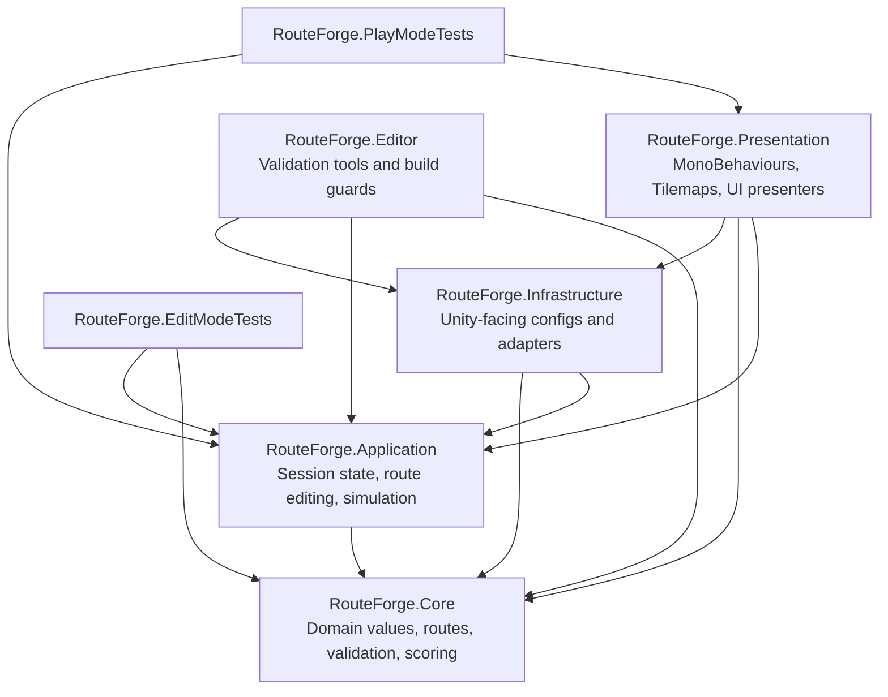

# RouteForge

Deterministic Unity route-building puzzle focused on testable gameplay architecture.


[](https://github.com/Keshbel/RouteForge/actions/workflows/ci.yml)
[](https://github.com/Keshbel/RouteForge/actions/workflows/release.yml)


## Download latest release

Download packaged builds from the [latest GitHub Release](https://github.com/Keshbel/RouteForge/releases/latest). Release artifacts are produced for Windows, Linux and WebGL when a valid `vMAJOR.MINOR.PATCH` tag passes tests.

## Gameplay overview

RouteForge is a small route-building puzzle. The player paints paths on a grid, switches between agents, starts the simulation, and receives a result based on how many agents reach their goals and how efficient their routes are.

The current project preserves the original prototype mechanics while moving the rules into deterministic domain code that can be tested without Unity scene state.

## Engineering highlights

- Pure `RouteForge.Core` domain layer without `UnityEngine`.
- Immutable grid positions, agent identifiers and ordered route snapshots.
- Route validation for starts, adjacency, blocked cells, cycles, goals and route conflicts.
- Explicit `GameSession` state machine: `Booting`, `Planning`, `Running`, `Paused`, `Completed`.
- EditMode tests for Core/Application behavior and PlayMode tests for Unity lifecycle wiring.
- Level validation tooling with custom inspector, project menu command and build preprocessor.
- CI workflows for Conventional Commit validation, Unity tests, coverage artifacts and tagged releases.

## Architecture diagram



## Project structure

```text
Assets/RouteForge/Runtime/Core
Assets/RouteForge/Runtime/Application
Assets/RouteForge/Runtime/Infrastructure
Assets/RouteForge/Runtime/Presentation
Assets/RouteForge/Editor
Assets/RouteForge/Tests/EditMode
Assets/RouteForge/Tests/PlayMode
Assets/Scripts
```

`Assets/Scripts` contains legacy scene-bound MonoBehaviours retained to preserve existing Unity serialization while the RouteForge assemblies define the target architecture.

## Controls

- Left mouse button: add route cells.
- Right mouse button: remove route cells.
- Cube switch button: switch the active agent.
- Start button: run all configured agents.
- Restart button: reload the current scene.

## Local setup

1. Install Unity `6000.3.11f1`.
2. Clone the repository with Git LFS enabled.
3. Open the project from the repository root.
4. Open `Assets/Scenes/MainScene.unity`.
5. Let Unity restore packages and regenerate IDE project files.

Git LFS is expected because Unity projects commonly contain binary assets.

## Running tests

Use Unity Test Runner:

```text
Window > General > Test Runner
Run EditMode tests
Run PlayMode tests
```

The CI workflow runs both modes through `game-ci/unity-test-runner@v4` and uploads test and coverage artifacts. See [docs/testing.md](docs/testing.md) for assembly boundaries, CI notes and known limitations.

## Release process

Releases are tag-driven. A release tag must match `vMAJOR.MINOR.PATCH` or a prerelease form such as `v1.0.0-alpha.1`.

```bash
git checkout main
git pull --ff-only
git tag -a v1.0.0 -m "RouteForge 1.0.0"
git push origin v1.0.0
```

See [docs/releasing.md](docs/releasing.md) for branch protection, secrets and release workflow details.

## Performance evidence

Profiler marker names and the measurement template are documented in [docs/performance.md](docs/performance.md). No performance numbers are claimed without a recorded profiler capture.

## Architecture decisions

Key decisions are documented in [docs/architecture.md](docs/architecture.md), including dependency direction, deterministic route representation, state transitions, event flow, and why ECS/DOTS and a DI container are intentionally not used here.

## Original test brief

The original assignment is preserved in [docs/original-brief.md](docs/original-brief.md) for traceability.

## License and third-party notices

RouteForge code is licensed under the [MIT License](LICENSE). Third-party notices are listed in [THIRD_PARTY_NOTICES.md](THIRD_PARTY_NOTICES.md).
