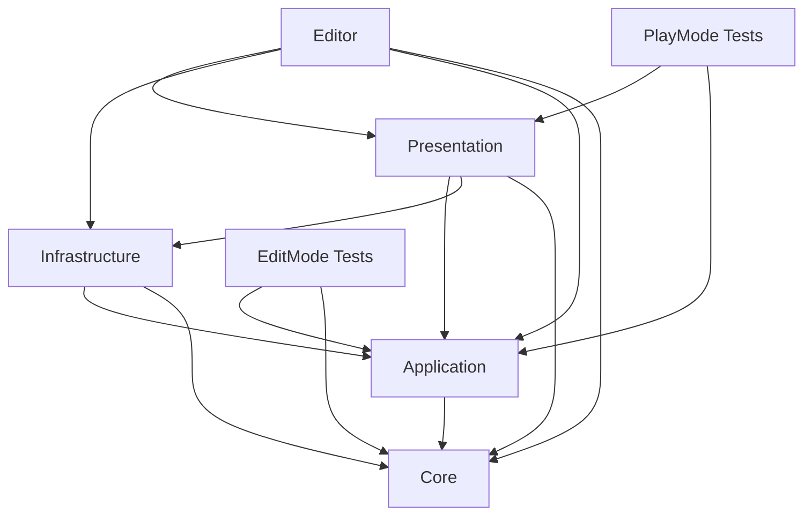
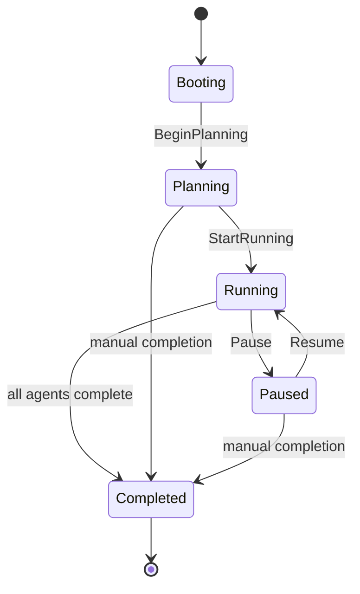
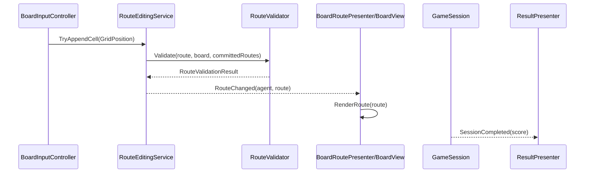

# Architecture

RouteForge separates deterministic puzzle rules from Unity presentation code. The goal is to keep route validation, scoring, generation and session state testable without scene lifecycle.

## Dependency direction

Dependencies point inward toward deterministic rules. `RouteForge.Core` does not reference `UnityEngine`.

## Assembly responsibilities

### Core

`RouteForge.Core` owns domain values and rules:

- `GridPosition`
- `AgentId`
- `Route`
- `BoardSnapshot`
- `RouteValidator`
- `ScoringPolicy`
- seeded level generation data

Core code is pure C# and avoids Unity scene state.

### Application

`RouteForge.Application` coordinates use cases:

- `GameSession` state transitions;
- `RouteEditingService` route mutation and validation orchestration;
- `AgentRouteSimulation` deterministic logical movement;
- `GameCompositionRoot` creation of Core/Application dependencies.

Application code raises typed C# events and does not use a global static event bus.

### Presentation

`RouteForge.Presentation` adapts Unity objects to application services:

- `BoardView` converts tilemap/cell data to domain values and renders routes.
- `BoardInputController` reads Unity input and forwards domain cells.
- `AgentMovementView` moves transforms from immutable route snapshots.
- presenters synchronize route, selection, simulation and result events.

Presentation may reference Unity APIs, but it should not own route rules.

### Infrastructure

`RouteForge.Infrastructure` contains Unity-facing configuration assets and adapters:

- `LevelDefinition` ScriptableObject;
- future scene loading or persistence adapters.

Infrastructure can reference Unity APIs when the asset or adapter is inherently Unity-specific.

## Composition root

The composition root creates services explicitly and passes dependencies to scene components. This replaces runtime reads through `AllSingleton.Instance`, `FindObjectOfType` and `Camera.main`.

Legacy scene scripts remain in `Assets/Scripts` to preserve MonoScript GUIDs while the RouteForge assemblies define the target architecture.

## Deterministic route representation

Routes are ordered immutable snapshots of grid cells:

- route cells are copied on creation;
- movement receives route snapshots instead of mutable route lists;
- validation checks starts, adjacency, blocked cells, repeated cells, target ownership and conflicts;
- seeded generation uses a local deterministic generator, not global random state.

This makes route behavior reproducible in EditMode tests.

## State machine

`GameSession` owns the session lifecycle:

Invalid transitions return `false` instead of mutating state.

## Event flow

Events are scoped to the owning service or presenter. There is no global static event bus.

## Test boundaries

EditMode tests cover deterministic code:

- route validation;
- scoring;
- session transitions;
- seeded generation;
- route editing and simulation rules.

PlayMode tests cover Unity lifecycle wiring:

- route presenter updates a board view;
- agent selection preserves route state;
- simulation runner starts, pauses and resumes;
- result presenter opens exactly once.

PlayMode tests use isolated GameObjects rather than the full production scene unless the test explicitly targets scene serialization.

## Why not ECS/DOTS

The current game has a small number of agents and grid routes. ECS/DOTS would add package, authoring and debugging overhead without a measured need. The current bottlenecks are architectural clarity, deterministic rules and test coverage.

## Why not a DI container

Dependencies are few and explicit. A small composition root provides enough clarity without runtime reflection, container configuration or additional package surface. If the object graph grows substantially, container adoption should be justified by measurable complexity reduction.

## Known trade-offs

- Some legacy `Assets/Scripts` MonoBehaviours remain to preserve serialized scene references.
- Presentation and Infrastructure are Unity-specific by design.
- CI can validate tests and builds, but full visual behavior still needs occasional Unity Editor review.
- ScriptableObject level validation is editor-time tooling; runtime levels should still guard against incomplete data at service boundaries.
