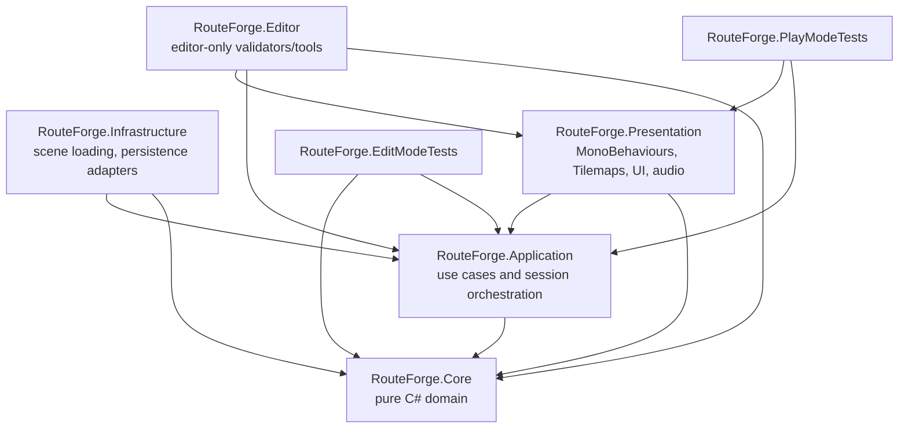

# RouteForge refactoring plan

## Discovered problems

- Gameplay scripts are in the default assembly and global namespace, so domain, UI, scene loading and third-party dependencies are compiled together.
- `AllSingleton` owns cross-scene/global access and performs runtime discovery through `FindObjectOfType<GameManager>()`.
- `GridController` mixes pointer input, tilemap rendering, Unity grid conversion, blocked-cell checks and route mutation.
- `Cube` owns both movement presentation and mutable route state through `public List<Vector3> pathList`; route execution chooses the next step with a distance search, so route order is not deterministic.
- `CubeController` mixes selected-agent state, end-session counting, camera rotation and movement start.
- `GameManager` mixes score calculation, session completion, result panel presentation and scene loading.
- `SoundBase` discovers every `Button` in the scene via `FindObjectsOfType<Button>().ToList()`, which is fragile, allocates and couples audio to scene hierarchy scans.
- Runtime hot paths depend on `AllSingleton`, `Camera.main`, public mutable fields and Unity types as gameplay state.
- Existing route rules are implicit: blocked cells are checked only while painting; adjacency, cycles, ownership, goal membership and route conflicts are not validated as domain rules.
- Serialized scene references currently point to scripts under `Assets/Scripts/Common` and `Assets/Scripts/UI`; moving files must preserve `.meta` GUIDs or keep compatibility wrappers until scene serialization is migrated.

## Target dependency graph

Core must not reference `UnityEngine`. Application owns deterministic use cases and state transitions. Presentation converts Unity values (`Vector3Int`, `Vector3`, tilemaps, buttons, transforms) to domain values and delegates decisions to Application/Core.

## Proposed architecture

- Introduce assembly boundaries:
  - `RouteForge.Core`: `GridPosition`, `AgentId`, `Route`, `RouteValidator`, `RouteValidationResult`, route conflict checks, `ScoringPolicy`.
  - `RouteForge.Application`: `GameSession`, `ESessionState`, `RouteEditingService`, agent route snapshots and typed events/presenter interfaces.
  - `RouteForge.Presentation`: `GameCompositionRoot`, `BoardInputController`, `BoardView`, `AgentMovementView`, `AgentSelectionPresenter`, `ResultPresenter`, `AudioPresenter`.
  - `RouteForge.Infrastructure`: scene reload adapter and other Unity-facing infrastructure that should not live in UI presenters.
  - `RouteForge.Editor`: optional serialized-reference and scene setup validators.
- Replace singleton reads with explicit serialized references on `GameCompositionRoot`, which creates domain/application services and injects them into presentation components during initialization.
- Keep existing mechanics unless a current behavior is a bug caused by non-deterministic route selection. In that case, preserve the visible rule ("agent follows painted cells toward goal") while making the path ordered and validated.
- Keep legacy scene script GUIDs during migration when possible by editing script contents in place first, then moving files with their `.meta` files only when scene references are stable.

## API design

- `readonly struct GridPosition`
  - immutable `X`, `Y` coordinates.
  - adjacency helper for four-direction board movement.
- `readonly struct AgentId`
  - immutable integer or string-backed identifier with value equality.
- `sealed class Route`
  - created from an ordered cell sequence.
  - exposes count, indexer and read-only iteration without allowing mutation.
  - can create immutable snapshots for movement.
- `RouteValidator`
  - validates one route against a `BoardSnapshot` and other committed routes.
  - checks start cell, segment adjacency, blocked cells, cycles, target membership and conflicts.
- `RouteValidationResult`
  - success flag plus compact error code/message for UI/debugging.
- `ScoringPolicy`
  - converts completed/failed agent outcomes into score and result text key/value.
- `GameSession`
  - owns `Booting`, `Planning`, `Running`, `Paused`, `Completed`.
  - exposes commands such as `BeginPlanning`, `StartRun`, `Pause`, `Resume`, `CompleteAgent`, `CompleteSession`.
  - raises small typed C# events for state, route and result changes.
- `RouteEditingService`
  - owns selected agent route editing and emits route changes after validation.
  - receives domain cells, not Unity `Vector3`.
- `BoardInputController`
  - reads input and camera raycasts through serialized `Camera`, converts hit cell to `GridPosition`, then calls `RouteEditingService`.
- `BoardView`
  - renders hover/path tiles and exposes board topology/block/goal data as domain snapshots.
- `AgentMovementView`
  - receives an immutable route snapshot and moves the Unity transform along mapped world positions.

## Edge cases

- Missing serialized references in composition root, presenters, tilemaps, camera, buttons or audio source must fail early with clear logs and keep UI interaction disabled instead of null-reference crashes.
- Empty route, route not starting adjacent to or at the agent start, route missing target, duplicate cells and diagonal/non-adjacent segments must be rejected by the validator.
- Blocked terrain cells must be rejected both while editing and before running, because scene data can change or be incomplete.
- Multiple agents cannot own the same route cell at run start unless a future design explicitly allows shared intersections.
- If an agent reaches the goal early, remaining rendered path cells for that agent should clear without mutating the movement snapshot.
- Restart must not depend on a gameplay static flag long term; introduction-panel state should be driven through a session/bootstrap service or scene-load parameter.
- Paused state must stop accepting route edits during running and must not complete a session twice when multiple movement coroutines finish in the same frame.

## Migration plan

1. Add this plan and keep the repository behavior unchanged.
2. Create target folders and asmdefs with conservative references; add compile-only placeholder types where needed.
3. Extract pure Core value objects and policies with edit-mode tests.
4. Add ordered route model and validator, then adapt route editing to use domain cells.
5. Introduce `GameSession` and route/session events while legacy components still drive the scene.
6. Add `GameCompositionRoot` and explicit dependency wiring, then remove runtime reads from `AllSingleton`.
7. Split `GridController` into `BoardInputController`, `BoardView` and `RouteEditingService`; split `Cube`/`CubeController` movement and selection responsibilities.
8. Replace `SoundBase` scene-wide button discovery with explicit UI events handled by `AudioPresenter`.
9. Move or retire legacy scripts only after scene references are migrated and compilation is verified.

## Unity serialization risks

- Moving scripts without their `.meta` files changes GUIDs and breaks `m_Script` references in `Assets/Scenes/MainScene.unity`.
- Renaming serialized fields loses scene values unless `[FormerlySerializedAs]` is used or the scene YAML is migrated deliberately.
- Replacing `UnityEvent` fields can remove inspector wiring on buttons and movement events; migrate listeners through explicit serialized references first.
- Adding asmdefs changes assembly-qualified type names. Existing UnityEvents serialized as `Assembly-CSharp` can break until listeners are rewired.
- New namespaces change `m_EditorClassIdentifier` behavior for MonoScripts compiled in asmdefs; scene validation in Unity Editor is required before claiming full serialization safety.

## Decisions intentionally not applied

- No DI container: dependencies are created and injected by a small composition root.
- No ECS/DOTS: board size and gameplay complexity do not justify the migration cost.
- No UniTask or reactive framework: coroutines and typed C# events are sufficient.
- No global static event bus: events remain scoped to session/services/presenters.
- No runtime hierarchy scanning in gameplay/UI paths: unavoidable discovery, if any, stays editor-only or bootstrap-only with documentation.
- No scene or prefab recreation: preserve existing GUIDs and serialized references during migration.
